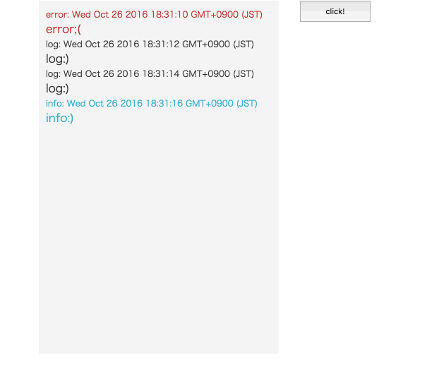

# react-console-logger

Display log.




## example
[example](./example)

```javascript
import {Logger, ConsoleLogger} from 'react-console-logger';

const myLogger = new Logger();

const root = () => (
  <div>
    <ConsoleLogger
      logger={myLogger}
    />
  </div>
);

myLogger.log('log');
myLogger.info('info');
myLogger.warn('warn');
myLogger.error('error');
```
